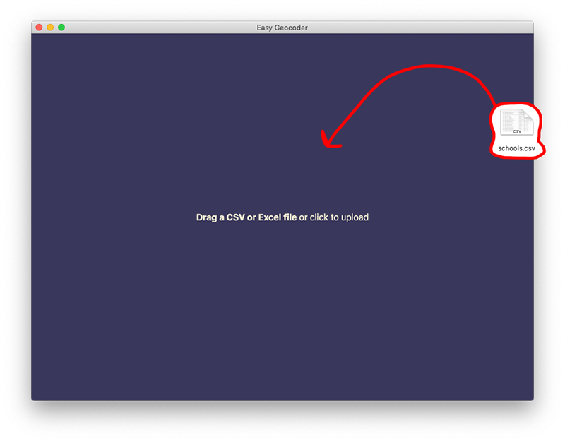
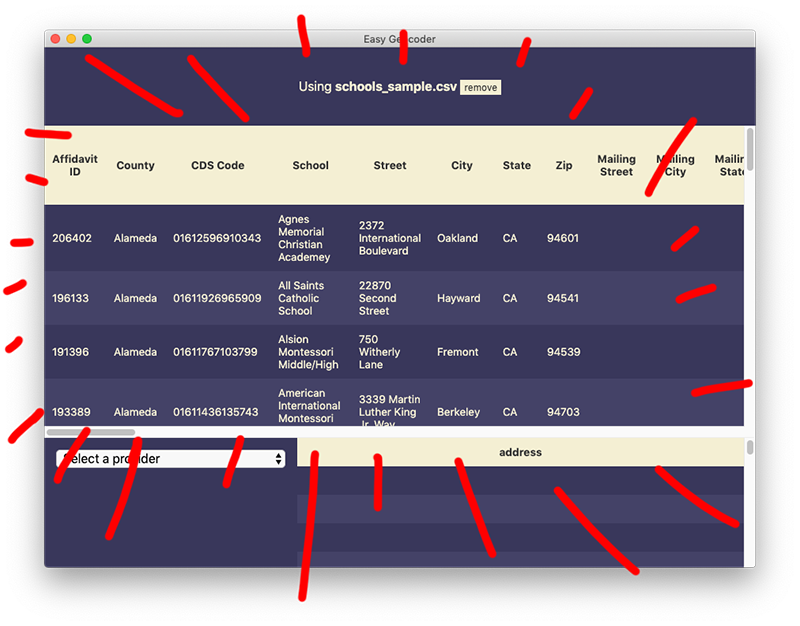
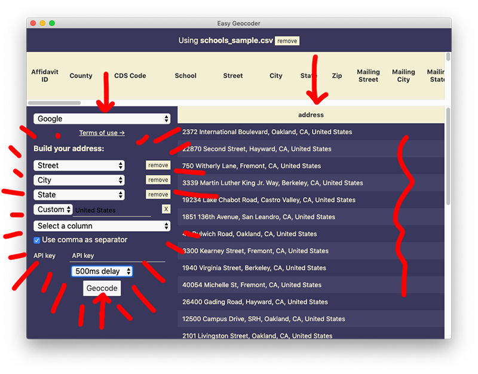
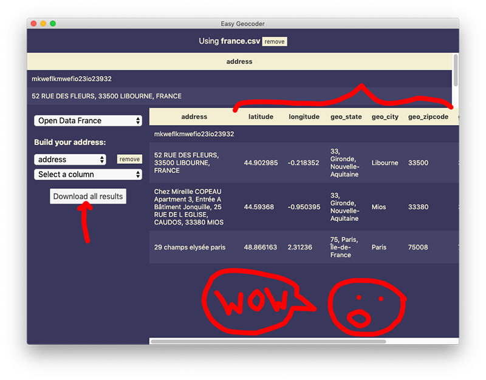
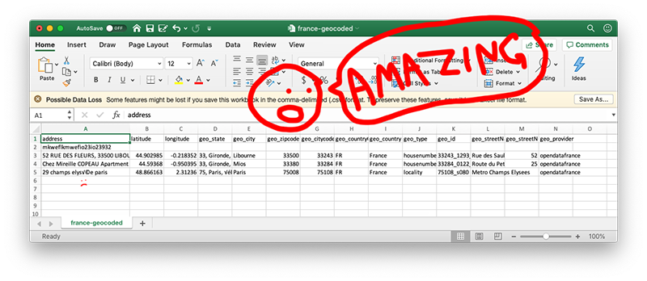

# Easy Geocoder

A simple, graphical interface to a million and one geocoding APIs. Works on OS X and Windows and probably even Linux!

## Step 0: Download it

[Download Easy Geocoder here](https://github.com/littlecolumns/easy-geocoder/releases/latest)

## Step 1: Feed it a file

Add in your CSV or Excel file.

## Step 2: Bask in the joy of preview

It'll be read in like magic, and the preview will show you a wholly reasonable selection of rows.

## Step 3: Prep your geocoder

Pick your geocoding service provider and pick what counts as the address you're geocoding. In the situation below, we're combining a few columns with the custom text "United States."

Did you know almost every geocoder except [Geocodio](http://geocod.io/) has terribly restrictive terms of service? Peruse them with a gentle click of the mouse!

## Step 4: Geocode

Click **Geocode** and you're ready to go! Along with latitude and longitude, you'll also receive any extra columns the geocoder decides to send back. These columns vary between providers.

## Step 5: Do whatever you want

The data you download is your original file **with the addition of geocoded data**. It's everything you've ever wanted and more!

## Fun facts

- If you hit an error (rate limits, missing an API key, malformed request, etc) you'll be able to resume without re-requesting the ones you have already.
- If you upload something with latitude and longitude columns? Easy Geocoder will skip the rows where it already has data.
- Results are temporarily cached, so if you try to request the same address multiple times it will re-use the original
- All of the heavy lifting is done by [node-geocoder](https://github.com/nchaulet/node-geocoder)
